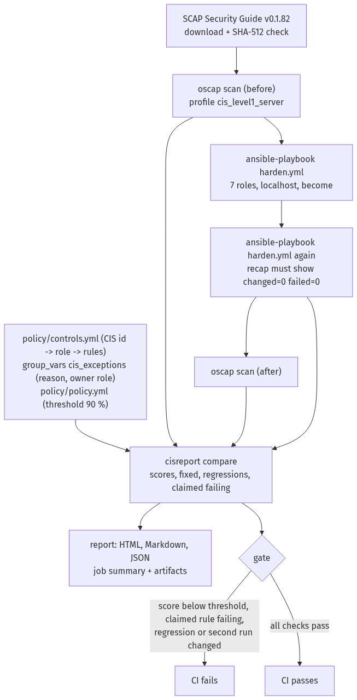

# Lab 11 — Ansible CIS hardening for Ubuntu 24.04

Harden a default Ubuntu 24.04 server to **CIS Ubuntu Linux 24.04 LTS Level 1 – Server** with our own Ansible roles,
one per benchmark section group, and measure compliance before and after with an independent scanner (OpenSCAP and
the ComplianceAsCode profile). A second playbook run proves idempotency, and a small Python tool (`cisreport`)
compares the two scans and fails CI on a low score, a claimed control that still fails, a regression or a second run
that changes something. Every control is traceable from its CIS id to the role that applies it and to the scanner
rules that check it.

**Status: in progress.** Results are added from the first CI runs.

> **Warning.** `scripts/run-hardening.sh` hardens the machine it runs on: firewall default-deny, SSH and PAM changes,
> packages removed, a bootloader password. Run it only on a disposable Ubuntu 24.04 host (a CI runner or a throwaway
> VM).

## How the cycle works



1. **Scanner content.** `scripts/get-ssg.sh` downloads SCAP Security Guide v0.1.82 and checks its SHA-512 against
   [`policy/policy.yml`](policy/policy.yml). If the asset changes or disappears the run stops; the scanner is never
   swapped silently.
2. **Scan before** with `oscap xccdf eval` and the profile `xccdf_org.ssgproject.content_profile_cis_level1_server`
   (ARF + HTML).
3. **Harden**: `ansible-playbook playbooks/harden.yml` applies the seven roles to `localhost` with `become`, in CIS
   section order. Every task is tagged with its CIS id and skipped when that id is a documented exception.
4. **Harden again**: the second run must report `changed=0` and `failed=0` on every host.
5. **Scan after** with the same content and profile.
6. **Report and gate**: `cisreport` reads both scans, the second-run recap,
   [`policy/controls.yml`](policy/controls.yml) (CIS id → role → SSG rules) and the exceptions in
   [`group_vars/all.yml`](group_vars/all.yml); it writes `out/report.html`, `out/summary.md` and `out/results.json`
   and applies the gate.

## Quick start

On a **throwaway** Ubuntu 24.04 VM with Python 3.12 and sudo:

```bash
python3 -m venv .venv && . .venv/bin/activate
pip install -r requirements-ansible.txt -r requirements-dev.txt && pip install --no-deps -e .
bash scripts/run-hardening.sh
# then open out/report.html (figures: out/results.json)
```

Roles in containers (Docker and Molecule, no host changes):

```bash
pip install -r requirements-ansible.txt
ansible-galaxy collection install -r requirements.yml
export ANSIBLE_COLLECTIONS_PATH="$PWD/.ansible/collections"
cd roles/cis_access && molecule test
```

Tasks that need a real kernel, bootloader or firewall are tagged `molecule-notest` and run only on the VM.

## Roles

| Role | CIS sections | What it does |
|---|---|---|
| `cis_initial_setup` | 1.1, 1.3–1.6 | unused filesystem modules, `/dev/shm` options, AppArmor (utils, bootloader, unconfined profiles to complain), bootloader password, ASLR, ptrace and core dumps, login banners |
| `cis_services` | 2.1–2.4 | unneeded servers and clients removed, time sync with `systemd-timesyncd` only, cron permissions |
| `cis_network` | 3.2–3.3 | uncommon network protocols unavailable, network kernel parameters (sysctl) |
| `cis_firewall` | 4.2 | ufw: loopback rules, explicit outbound rules, an inbound rule for every listening port, default deny in, out and routed |
| `cis_access` | 5.1–5.4 | SSH drop-in, sudo (`use_pty`, log file, timeout, `secure_path`), `su` restriction, PAM password quality, faillock and history, ageing, system accounts, shell timeout and umask |
| `cis_logging` | 6.1 | journald forwards to rsyslog, `/var/log` permissions and ownership (the profile's logging path is rsyslog; auditd is not in Level 1) |
| `cis_maintenance` | 7.1–7.2 | account file permissions, world-writable files, unowned files, user dot files, empty passwords |

[`docs/controls.md`](docs/controls.md) lists every control the roles claim (generated by `cisreport controls-md`):
92 CIS controls and 127 scanner rules: every rule that failed on the default runner and that a role fixes, plus rules
that only apply once a role installs their package (password quality, time sync).

## Exceptions

Exceptions are data, not hidden skips: each has a reason and an owner role, the tasks skip it, and the report shows
the score both with and without the excepted rules. An exception for a rule the roles also claim, without a reason,
or for a rule the profile does not contain is a configuration error.

| CIS | Rules | Reason |
|---|---|---|
| 1.1.2.1.1 | `partition_for_tmp` | a booted CI runner cannot be repartitioned; `/tmp` stays on the root filesystem |
| 4.3 | nftables variant, `package_ufw_removed` | CIS 4.1.1 asks for one firewall utility and this lab uses ufw (4.2); the nftables rules cannot pass while ufw manages the firewall |
| 6.3.1 | `package_aide_installed`, `aide_build_database` | building the AIDE database of a large, short-lived runner image did not finish in 15 minutes; file integrity monitoring belongs on long-lived servers |

Runner guardrails, kept on purpose: outbound traffic stays open on the ports the job needs (DNS, HTTP, HTTPS, NTP)
so the runner can report to GitHub, and the `runner` account keeps its passwordless sudo for the rest of the job.

## Gate

CI fails (exit 1) when:

- the after score excluding exceptions is below **90 %** (`pass / (pass + fail)` over the profile's selected rules);
- a rule in `policy/controls.yml` still fails after hardening;
- a rule passed before and fails after (a regression), even if the overall score rose;
- the second playbook run reports `changed > 0` or `failed > 0` on any host.

A scan that did not really happen — missing or empty results, a profile that selected no rules, results that are all
`error`/`notchecked` — or a missing recap is an error (exit 2), never a score.

## CI and tests

| Job | What it proves |
|---|---|
| `lint` | yamllint, ansible-lint (production profile), ruff, mypy (strict), shellcheck |
| `unit` | `cisreport` against fixture results: parsing, empty and mismatched scans, exceptions, regressions, claimed-but-failing, recap parsing, threshold edges, report escaping; coverage gate 90 % |
| `molecule` | each role in a Docker Ubuntu 24.04 container: converge, idempotence, verify |
| `harden` | the whole cycle on the runner VM; artifacts: scans before and after (ARF/HTML), report (HTML/Markdown/JSON), playbook logs; Markdown job summary |
| `secrets` | gitleaks over the full history |

The cycle also runs weekly and on demand.

## Limits

- The target is a GitHub-hosted runner, not a production server; some Level 1 controls are exceptions because the
  runner is booted and short-lived.
- The score comes from the ComplianceAsCode profile, which follows CIS but is not CIS-CAT and not a certification.
- Settings that need a reboot (AppArmor on the kernel command line, the bootloader password) are written and checked
  by the scanner, not booted into.
- Out of scope: Level 2, Windows Server, CIS-CAT Pro, fleet management (AWX, large inventories).

## License

MIT — see [LICENSE](LICENSE).
